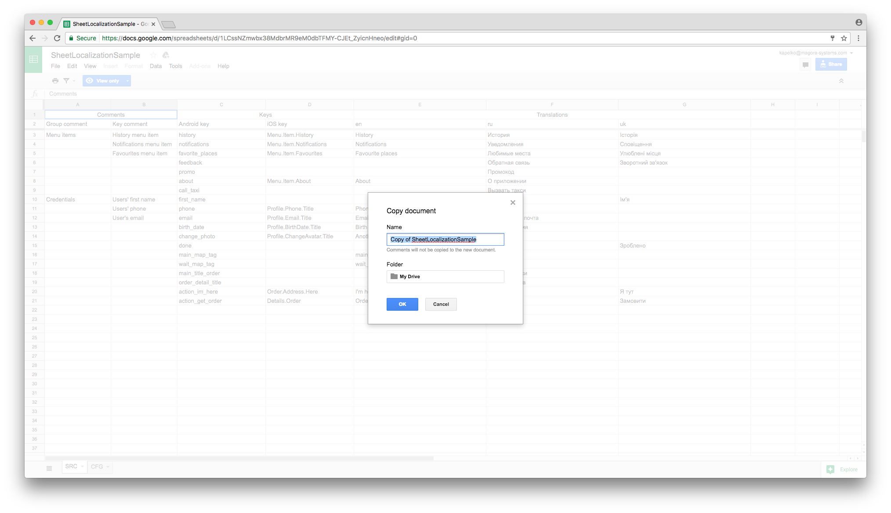
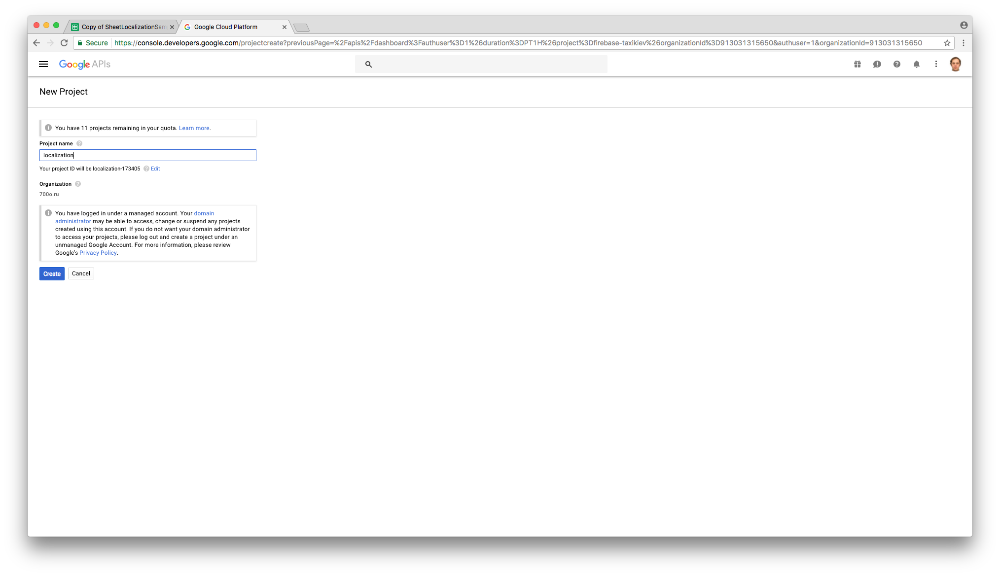
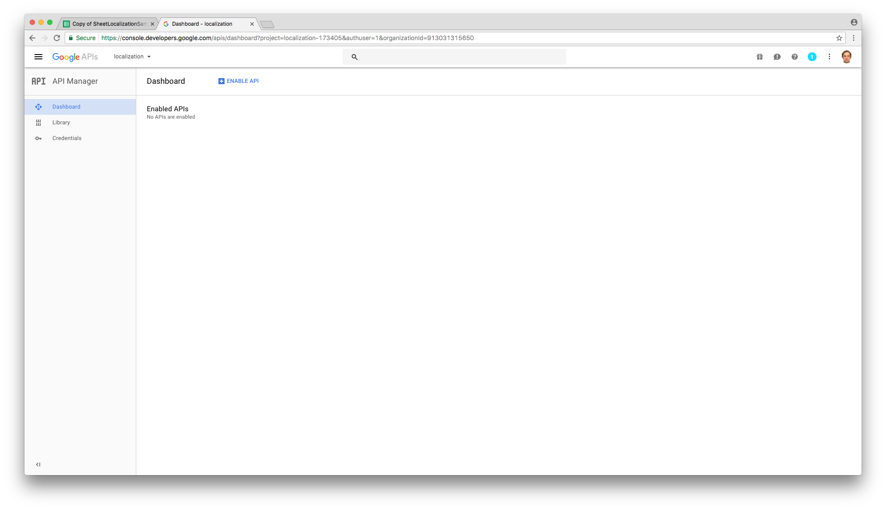
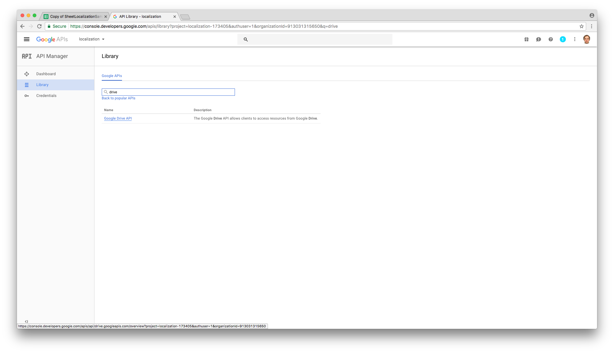
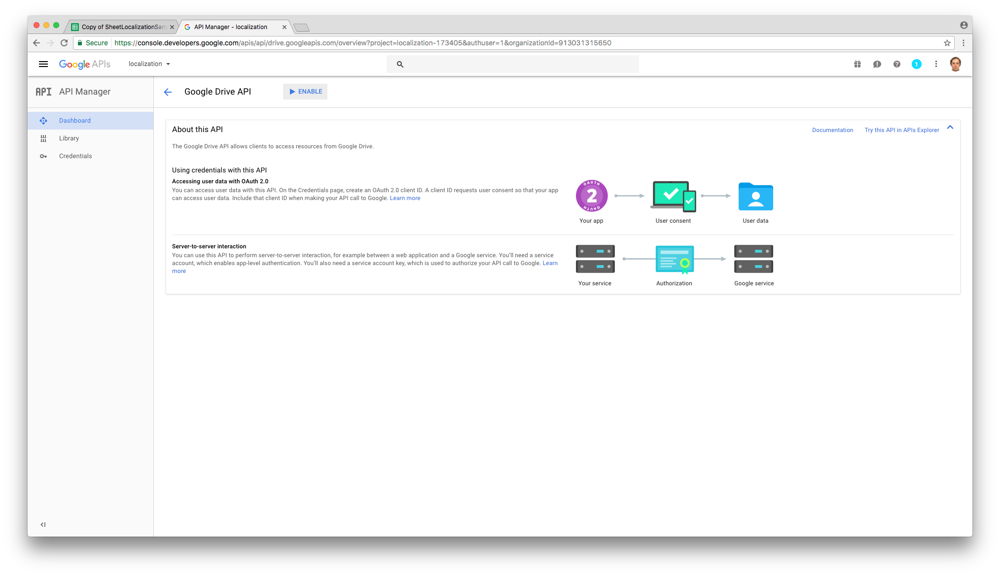

# Overview

`sheet-localization` generates Android / iOS localization files from single Google Spreadsheet.

# Command line parameters

You generally run `sheet-localization` like this:

`python /path/to/sheet-localization/main.py /path/to/account_credentials.json SpreadSheetName TargetName`

1. `account_credentials.json` is a file you get after registering Google service account
1. `SpreadSheetName` is the name of the spreadsheet to open
   **Note**: Google service account must be given read permission to access the spreadsheet
   by sharing the document with the service account's email
1. `TargetName` is either `android` or `ios`.

# Android generated files

`sheet-localization` generates `res/value-<lang>/strings.xml` hierarchy in the current directory.

# iOS generated files

`sheet-localization` generates `<lang>.lproj/Localizable.strings` hierarchy in the current directory.

The script also generates `LocalizationConstants.h`, `LocalizationConstants.m` files with
translation constants.

# Dependencies

1. Google service account
1. The account must be given read permission to a spreadsheet
1. gspread 

# Step by step guide

## 1. Clone sample Google spreadsheet

Clone [sample spreadsheet](https://goo.gl/41wame) to your Google Drive.

## 2. Create new Google API project

Go to [Google API console](https://console.developers.google.com) and create a new project.

## 3. Enable Google Drive API

Enable Google Drive API.

## 4. Create service account

